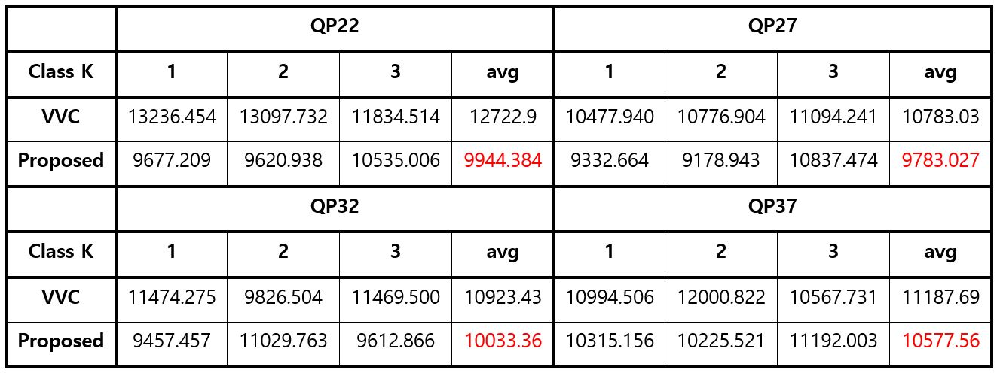
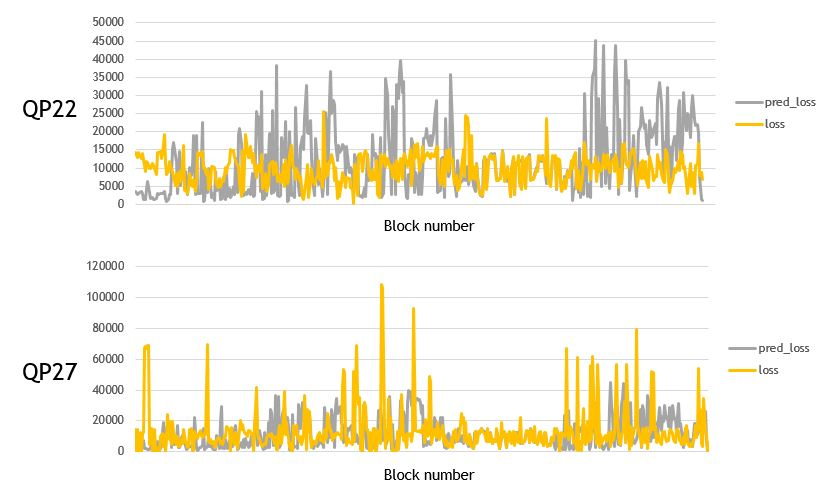
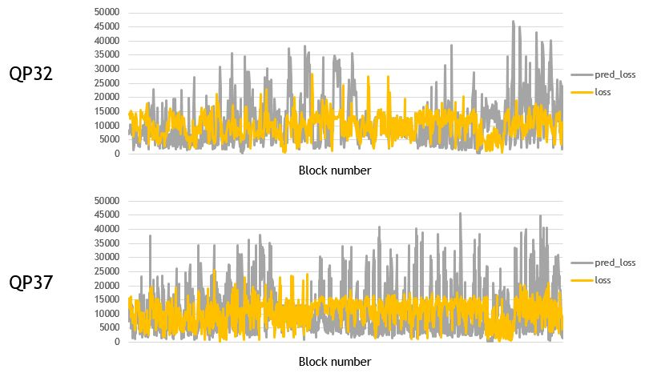

# NNVC-IP
경희대학교 컴퓨터공학과 캡스톤디자인2    
주제: Neural Network based Intra Prediction for post-VVC

Team
-------------
#### professor
김휘용

#### Student 
2018102242	최승미	<2018102242@khu.ac.kr>    

Our Test Sequence
-------------
#### The Common Test Conditions(CTC) of the test sequence we used are as follows.
- Chroma Format: YUV 4:2:0
- Input bit-depth: 8
- VVC QP: 22, 27, 32, 37

#### VVC test Sequence
Class C, D

#### CLIC 2020
Train, Test, Valid

Reference Software
-------------
VVC (VTM 9.0):
[Download VTM](https://vcgit.hhi.fraunhofer.de/jvet/VVCSoftware_VTM/-/tags)
[Download Documents](https://jvet.hhi.fraunhofer.de/)

Our Proposed Method
-------------
### Encoder Process
1. 주변 블록 전처리
2. 주변 블록 군집화 및 모델을 사용한 예측 생성
3. 예측 후처리

### Training Process
1. 원본 영상 준비
2. 본 프로젝트 파일의 VTM을 통해 원본 영상에 대한 best mode 정보, 예측 신호, 복호화된 주변 영상 획득
3. 1, 2번을 활용한 데이터셋 전처리
4. 군집 모델 및 생성 모델 학습
5. 후처리 및 테스트

Performance Test
-------------
### MSE Loss
    
### MSE Loss Graph
 |    

Code explanation
-------------
#### The Directory Structure
{local directory settings}    
public directory settings   
```
.
├── README.md
├── .gitignore
├── VTM               // reference software VTM 9.0
|   ├── {bin}                   // VTM 실행 폴더
|   |   ├── input               // VTM input
|   |   ├── output              // VTM output for traind dataset
|   |   ├── output_anchor       // VTM output for inference dataset (predictor 신호 포함)
|   |   ├── EncoderApp.exe      // VTM Encoder
|   |   ├── DecoderApp.exe      // VTM Decoder
|   |   ├── encoder_intra_vtm(and train).cfg      // cfg file
|   |   └── *.bat</span>        // VTM run bat files
|   └── ...
├── checkpoint          // models folder
├── {train_data}        // 전처리를 마친 train dataset folder
├── {valid_data}        // 전처리를 마친 validation dataset folder
├── {anchor_data}       // 전처리를 마친 inference dataset folder
├── {runs}              // train tensorboard log folder
├── {log_csv}           // train csv log folder
├── dataset
|   ├── load_dataset.py   // Custom Dataset code
|   └── make_dataset.py   // Preprocessing and make dataset code
├── models
|   ├── __init__
|   ├── alexnet.py        // alexnet code
|   ├── tapnn.py          // proposed model code
|   └── vgg16.py          // vgg16 code
├── {config.py}               // total config file
├── inference.py              // inference and test code
├── make_CLIC_VTM_bat.py      // make vtm run bat file code for Image Dataset
├── make_CTC_VTM_bat.py       // make vtm run bat file code for Test sequence 
├── train.py              // proposed model train code
├── train_cluster.py      // cluster model train code
└── util.py               // utils code   
```

#### 명령어
```python
python train.py --epochs [epochs] -lr [learning rate] --batch-size [batch size] -hgt [block height] - wdt [block width] -q [quality] --clusterk [index of cluster] --cuda --save    
```
```python
python train_cluster.py --epochs [epochs] -lr [learning rate] --batch-size [batch size] -hgt [block height] - wdt [block width] -q [quality] --cuda --save     
```
```python
python inference.py --batch-size [batch size] -hgt [block height] - wdt [block width] -q [quality] --clusterk [index of cluster] --cuda   
```
